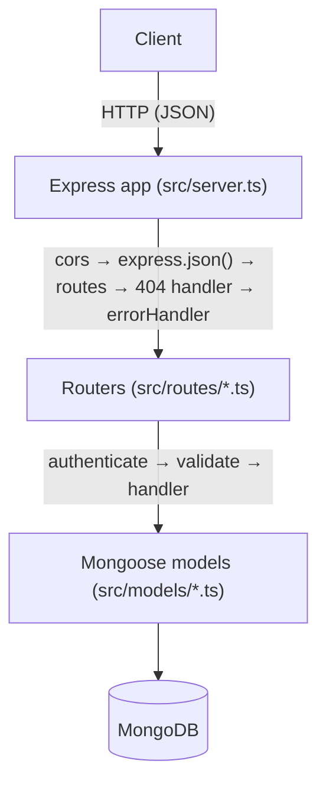
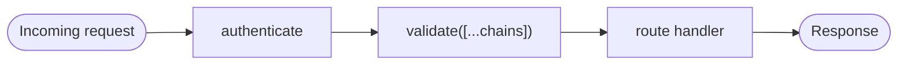
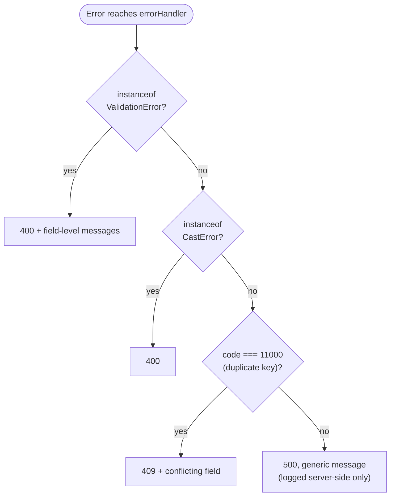
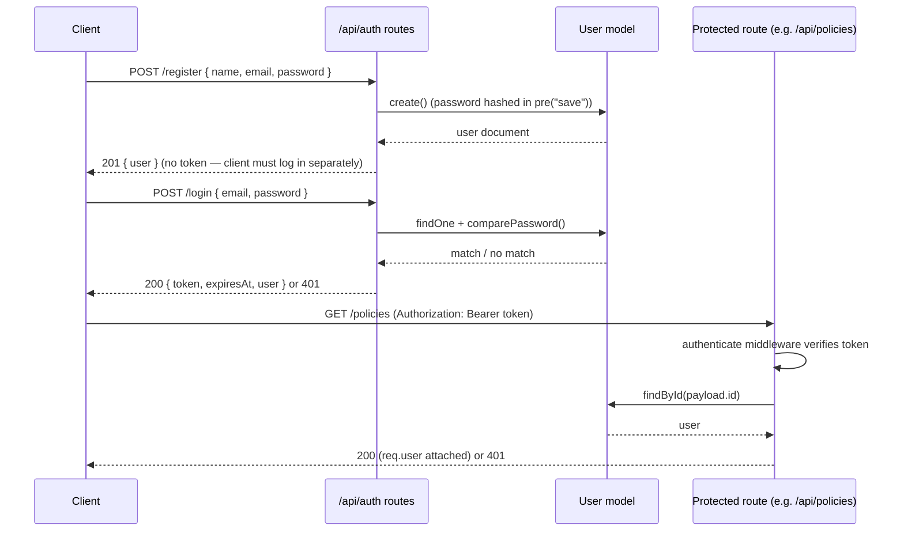
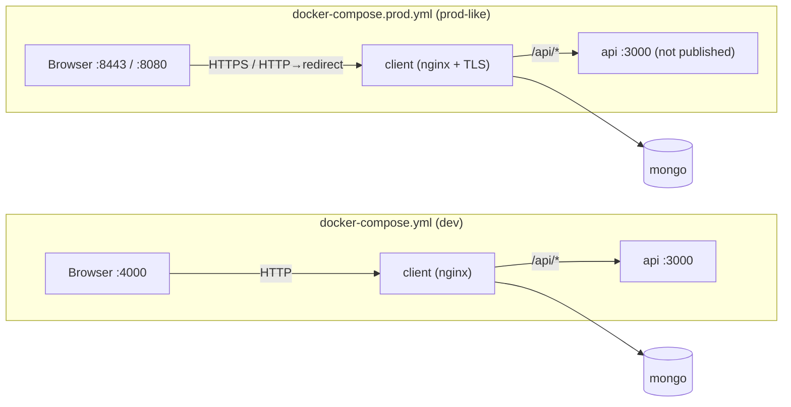

# Architecture

> All file paths below (`src/...`, `package.json`, etc.) are relative to [`backend-api/`](../backend-api/), where the application lives.

## Overview

A single Express application (`src/server.ts`) exposes a JSON REST API backed by MongoDB. A React client (`frontend-client/react-ts/`, documented separately in [its own README](../frontend-client/react-ts/README.md)) consumes this API; the two are developed and deployed independently, with the frontend's dev server proxying `/api` requests to this backend.

## Entry point

`src/server.ts` is the single entry point (there is no separate `app.ts`/`index.ts` split). In order, it:

1. Loads environment variables (`dotenv.config()`) — must happen before any other import touches `process.env`.
2. Configures the Express app: `cors()`, `express.json()`, the `/api/health` check, then mounts every router under `/api`.
3. Registers a 404 handler and the centralized `errorHandler` last.
4. Connects to MongoDB (`connectDB()`) and only then starts listening.

The server intentionally does **not** pass a callback to `app.listen()`. Express binds a passed callback to both the `listening` and `error` events, so on a port conflict it would still fire the "success" callback. Instead, `listening`/`error` are attached directly to the returned `http.Server`, so a real bind failure (e.g. `EADDRINUSE`) logs the actual error and exits non-zero instead of falsely reporting success.

## Request pipeline

Every protected route follows the same shape:

- **`authenticate`** (`src/middleware/auth.ts`) reads `Authorization: Bearer <token>`, verifies it with `JWT_SECRET`, loads the user, and attaches it as `req.user`. Returns 401 for any missing/invalid/expired token or a user that no longer exists.
- **`validate`** (`src/middleware/validate.ts`) takes an array of `express-validator` chains, runs them, and returns 400 with error details if any fail — otherwise calls `next()`.
- Route handlers are `async` and assume Express 5's automatic forwarding of rejected promises to error-handling middleware — there's no manual `try/catch` per route.

Errors that reach the end of the chain are handled centrally by `src/middleware/errorHandler.ts`:

## Auth flow

## Data layer

Models live in `src/models/` and are plain Mongoose schemas:

- **`User`** — hashes its password in a `pre("save")` hook (bcrypt, 12 rounds) and strips `password` from `toJSON()` output.
- **`Policy`** — owned by a `User` (`owner` ref); `policyNumber` is uppercased/trimmed and unique.
- **`Claim`** — references a `Policy` and an `assignedTo` `User`; auto-generates a sequential `claimNumber` (`CLM-1000`, `CLM-1001`, …) in a `pre("save")` hook based on `countDocuments()`, and embeds `notes` as sub-documents (`{ author, text, createdAt }`).

See [`DESIGN.md`](DESIGN.md) for the reasoning behind these choices, including an entity-relationship diagram of how the three models relate.

## Containerized deployment

Two Compose files at the repo root (`docker-compose.yml`, `docker-compose.prod.yml`) wrap the same three pieces — `mongo`, `api` (`backend-api/Dockerfile`), `client` (`frontend-client/Dockerfile`) — into containers; see the root [README](../README.md#running-with-docker) for how to run them. The main difference between the two is how the client is fronted:

In both cases nginx (baked from `frontend-client/nginx.conf` or, in prod, `nginx-ssl.conf` bind-mounted over it) serves the built SPA and proxies `/api/*` to the `api` service by Docker service name, so the browser only ever talks to one origin — the same shape as the Vite dev-server proxy used outside Docker. `docker-compose.prod.yml` additionally mounts a self-signed cert (`generate-certs.sh`) and does not publish the `api` port to the host at all, since only the `client` container needs to reach it.

## Testing

The Vitest suite (`vitest.config.mts`) splits into two kinds of tests:

- **Pure unit tests** — no database: `Policy` model validation (via `.validate()` on an unsaved document), `generateToken`, the `validate` and `errorHandler` middleware, and `authenticate` (with the `User` model mocked via `vi.mock`).
- **DB-backed tests** — `User` and `Claim` models, since their behavior (password hashing, claim-number generation) only fires on `.save()`. These connect to a dedicated `policy-claims-test` MongoDB database via `src/test/db.ts` helpers, cleared between tests.

Because the DB-backed tests share one real external database, `vitest.config.mts` sets `fileParallelism: false` — running test files concurrently was observed to race one file's cleanup (`afterEach`) against another file's in-progress assertions, producing a flaky duplicate-key test. Running files sequentially trades a small amount of speed for determinism.

Route handlers themselves are not unit-tested directly — they're thin composition of already-tested middleware and models. They were verified manually end-to-end against a live server and MongoDB instance during development (auth flows, CRUD lifecycles, filtering/pagination, aggregation, and error paths).
